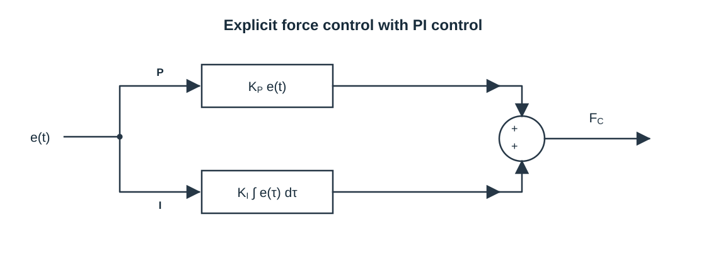

# 显式力控制（Explicit Force Control）与闭环控制框图

## 领域归属

- 主领域：Engineering / Robotics / Force Control。
- 上游知识：反馈控制、误差定义、PI/PID、机器人执行器与力传感器、接触动力学。
- 并列知识：刚度控制、阻抗控制、导纳控制、隐式力控制、混合力/位置控制。
- 下游应用：恒力压合、表面跟随、磨抛、接触装配及插入任务中的力调节环节。

## 什么是显式力控制

显式力控制（explicit force control）是一种主动闭环力控制方法：给定期望力，将力传感器测得的实际力反馈回来，与期望力比较得到力误差；控制器根据误差调整控制输入，使实际力向目标力收敛。

核心不是“机器人测到力”，而是**测得的力直接参与反馈闭环**。控制器使用的是实际测量值，而不是只根据预先设定的位置或电机电流推测接触力。NISTIR 7901 将其描述为：传感力进入紧密反馈回路形成力误差，误差用于调整命令力变量；报告以 PI 控制说明误差如何影响施力及收敛速度。

## 闭环控制系统框图

这种图通常叫**控制系统框图**（control-system block diagram），若强调测量量返回并与目标比较，也叫**闭环反馈控制框图**（closed-loop feedback control block diagram）。显式力控制可以抽象成：

[点击打开原尺寸 SVG 矢量图，在浏览器中缩放查看](Explicit-Force-Control-Block-Diagram.svg)

比较点计算：

$$
e = F_S - F_C
$$

圆形节点是求和点：测量力 $F_S$ 进入正端，命令力 $F_C$ 返回负端，形成误差 $e$；误差进入 `Control Law`，输出命令力。图只保留 NIST Figure 1 所表达的这几个信号和控制元素，没有展开传感器处理、机器人模型或具体 PI/PID 结构。

这是按 NIST Figure 1 的元素和信号关系重新绘制的简图，不是对原图的逐像素复制。原文说明，测量力与命令力之间的差值驱动机器人运动；控制律的具体形式在后文另行讨论。

### Figure 2：PI 力控制律

NIST 的 A 节还给出第二张图：把 Figure 1 的 Control Law 展开为比例（P）和积分（I）两条并行支路，再将两支路的输出相加得到命令力 $F_C$。

[点击打开 PI 框图原尺寸 SVG 矢量图](Explicit-Force-Control-PI-Block-Diagram.svg)

其中 P 支路按当前误差 $e(t)$ 产生 $K_P e(t)$；I 支路累积误差，产生 $K_I \int e(\tau)\,d\tau$。两项相加体现了 PI 控制器的组成。该图对应 NIST Figure 2，不是另一种独立的力控算法。

### Figure 1 的信号符号

Figure 1 标出测量力 $F_S$、误差比较、Control Law 和命令力 $F_C$，没有标出 $u(t)$，也没有说明控制器内部变量的物理单位。不要把其他控制框图中常见的符号补进这张图；具体 Demo 的控制器输出见“与单轴恒力 Demo 的关系”。

## 目标力为 2 N 的 PI 仿真

下面的仿真可以开始、结束并继续运行；跑满 8 秒后自动结束，再次开始会从零状态重播。曲线显示目标力与实际力，实时读数显示误差、比例项、积分项和 PI 输出。

<iframe src="PI-Force-Control-Simulation.html" title="目标力为 2 N 的 PI 力控制仿真" width="100%" height="460" loading="lazy"></iframe>

[单独打开 PI 力控制仿真](PI-Force-Control-Simulation.html)

该页面使用一个理想一阶受控对象来演示 PI 反馈过程，不是压力板、雷赛驱动或 Demo 的实测数据。仿真对象模型为：

$$
\dot{F} = \frac{F_C - F}{\tau}, \qquad e = F_d - F
$$

其中 $F_d=2\,\mathrm{N}$，$F_C=K_p e+K_i\int e(t)\,dt$；示例参数为 $K_p=1.0$、$K_i=2.2$、$\tau=0.55\,\mathrm{s}$。模型只用于直观看到 P 项对当前误差的响应、I 项随持续误差累积，以及输出如何令实际力逐步收敛；不能据此推断 Demo 的雷赛运动学或设备响应。

## PI 控制器在力环中的作用

理想化 PI 形式可写为：

$$
F_C(t) = K_p e(t) + K_i \int e(\tau)\,d\tau
$$

- 比例项 $K_p e$ 对当前误差作出响应；误差越大，控制修正通常越大。
- 积分项 $K_i \int e(\tau)\,d\tau$ 累积持续存在的误差，可推动系统消除长期偏差。
- 积分并非越大越好。命令饱和、接触突然建立、测量延迟或环境刚度较高时，积分可能累积过多并造成超调；工程实现通常需要积分限幅、抗饱和和安全力/行程限制。

控制周期、传感器噪声、滤波延迟、机器人内环响应、环境刚度都会影响稳定性。报告中的 PI 方框图用于解释基本闭环原理，不代表任意 PI 参数都能稳定工作，也不替代具体机器人的稳定性分析和安全验证。

## 它能控制什么，不能单独判断什么

在传感器测量有效、坐标和符号正确、反馈及时的前提下，显式力控制可以调节指定方向上的接触力。若只测一个方向的标量力，它不能单独判定接触对象是否正确、零件是否对准、是否发生侧向卡滞或插入是否到位；这些任务还需要额外状态、传感器或事件逻辑。

因此，恒力保持和柔顺装配相关但不等价：力闭环可以承担装配中的力调节部分，但对准、搜索、接触状态识别和卡滞处理属于更大的任务/控制结构。

## 与单轴恒力 Demo 的关系

Demo 将压力板读数换算为力，计算目标力与测量力之间的误差，再由 PID 生成 Z 轴速度命令。它明确使用力反馈闭环；但从控制器输出物理量看，PID 输出是**速度**而不是直接的力/力矩命令，因此不能把 Demo 的控制器方框直接等同于纯粹的力命令型显式力控。它更适合作为“外层力误差调节运动命令”的单轴案例。进一步归类时还要检查雷赛运动接口和底层驱动内部是否包含速度、位置或力矩伺服环。

## 如何评价一个力闭环

测试时至少记录期望力、测量力和时间戳，并观察：

- 超调量和峰值力；
- 稳定时间及进入容差带后的持续波动；
- 稳态误差和力误差变化；
- 接触建立时是否振荡，遇到扰动或障碍时是否继续安全稳定；
- 多次重复的结果是否一致。

NISTIR 7901 的力控评价部分特别讨论稳定时间、受阻稳定性、控制结构切换稳定性、表面接触保持和力上限。具体实验指标应结合任务选择；装配还需考虑成功率、完成时间和零件损伤风险。

## 与其他控制概念的区别

显式力控制 A 的识别重点是：外部测得的力是否直接进入反馈回路并参与误差调节。刚度、阻抗、导纳、隐式力和自然导纳是相关但不同的控制关系，实际系统也可能组合它们。NISTIR 7901 的 B–F 算法解释，以及它们与恒力 Demo、USB 插拔的关系，见[机器人力控制算法分类：NISTIR 7901 的 A–F 方法](Robot-Force-Control-Algorithm-Categories.md)。

## 相关知识

- 上游：反馈控制系统、PI/PID、离散采样、积分饱和、传感器标定与滤波、接触力学。
- 并列：机器人刚度控制、阻抗控制、导纳控制、隐式力控制、混合力/位置控制。
- 下游：恒力压合、表面跟随、磨抛、Peg-in-Hole、USB/连接器插拔、接触状态识别。

## 参考资料

- Jeremy Marvel, Joe Falco, [Best Practices and Performance Metrics Using Force Control for Robotic Assembly, NISTIR 7901](https://www.govinfo.gov/content/pkg/GOVPUB-C13-d554356d2e6e8bcd33d4ebb8b45e370e/pdf/GOVPUB-C13-d554356d2e6e8bcd33d4ebb8b45e370e.pdf), 2012，Section V-A、Section VII。
- 相关总览：[机器人恒力控制与柔顺装配学习路线](Robot-Force-Control-and-Compliant-Assembly-Learning-Path.md)。
