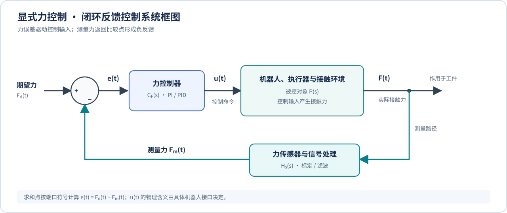

# 显式力控制（Explicit Force Control）与闭环控制框图

## 领域归属

- 主领域：Engineering / Robotics / Force Control。
- 上游知识：反馈控制、误差定义、PI/PID、机器人执行器与力传感器、接触动力学。
- 并列知识：刚度控制、阻抗控制、导纳控制、隐式力控制、混合力/位置控制。
- 下游应用：恒力压合、表面跟随、磨抛、接触装配及插入任务中的力调节环节。

## 什么是显式力控制

显式力控制（explicit force control）是一种主动闭环力控制方法：给定期望力，将力传感器测得的实际力反馈回来，与期望力比较得到力误差；控制器根据误差调整控制输入，使实际力向目标力收敛。

核心不是“机器人测到力”，而是**测得的力直接参与反馈闭环**。控制器使用的是实际测量值，而不是只根据预先设定的位置或电机电流推测接触力。NISTIR 7901 将其描述为：传感力进入紧密反馈回路形成力误差，误差用于调整命令力变量；报告以 PI 控制说明误差如何影响施力及收敛速度。

## 闭环控制系统框图

这种图通常叫**控制系统框图**（control-system block diagram），若强调测量量返回并与目标比较，也叫**闭环反馈控制框图**（closed-loop feedback control block diagram）。显式力控制可以抽象成：

[](Explicit-Force-Control-Block-Diagram.svg)

[点击打开原尺寸 SVG 矢量图，在浏览器中缩放查看](Explicit-Force-Control-Block-Diagram.svg)

比较点计算：

```text
e(t) = Fd(t) - Fm(t)
```

图中 `Σ` 是求和/比较点，反馈端标 `−` 表示测量力从目标力中扣除。`C_F` 是力控制器，`Hs` 表示传感器链路，可能包括比例换算、坐标变换、去偏置和滤波。机器人、执行器和接触环境共同构成被控对象：控制输入作用于机器人，机器人接触环境后产生实际力，传感器再测量该力并反馈。

图为适配本文概念的矢量重绘，使用标准方框、求和点和带方向的信号线表达闭环关系；它是原理示意，不是 NIST Figure 1 的逐像素复制。

### 控制输入不一定是同一种物理量

框图中的 `u(t)` 是抽象控制输入，具体可能是执行器力/关节力矩，也可能是机器人接口允许的运动命令。NIST 对显式力控的概念描述强调“由力误差调整命令施力”；实际系统中仍要结合控制器结构和机器人接口，查明控制器输出究竟是什么。

因此，不能仅因为程序使用 PI/PID 就认定它一定是显式力控制，也不能仅因为它最终让机器人动了就认定它是某一类算法。分类要看闭环信号关系、控制器输出量，以及是否存在机器人内部的力/力矩伺服环。

## 目标力为 2 N 的例子

假设控制方向和传感器正方向已统一，期望力 `Fd = 2 N`：

1. 实际测量 `Fm = 1.5 N`，则 `e = +0.5 N`。控制器判断当前作用力不足，向增加目标作用力的方向调整命令。
2. 实际测量 `Fm = 2.2 N`，则 `e = -0.2 N`。控制器判断作用力超过目标，向减小目标作用力的方向调整命令。
3. 控制器持续重复测量、比较、调整，使误差趋近于零或落入允许的力误差带。

实际正负方向取决于传感器坐标系、安装方向和机器人轴方向，调试时必须用已知方向的小动作验证符号；符号接反会形成正反馈，力越偏离，命令越把它推远。

## PI 控制器在力环中的作用

理想化 PI 形式可写为：

```text
u(t) = Kp · e(t) + Ki · ∫ e(τ) dτ
```

- 比例项 `Kp · e` 对当前误差作出响应；误差越大，控制修正通常越大。
- 积分项 `Ki · ∫e` 累积持续存在的误差，可推动系统消除长期偏差。
- 积分并非越大越好。命令饱和、接触突然建立、测量延迟或环境刚度较高时，积分可能累积过多并造成超调；工程实现通常需要积分限幅、抗饱和和安全力/行程限制。

控制周期、传感器噪声、滤波延迟、机器人内环响应、环境刚度都会影响稳定性。报告中的 PI 方框图用于解释基本闭环原理，不代表任意 PI 参数都能稳定工作，也不替代具体机器人的稳定性分析和安全验证。

## 它能控制什么，不能单独判断什么

在传感器测量有效、坐标和符号正确、反馈及时的前提下，显式力控制可以调节指定方向上的接触力。若只测一个方向的标量力，它不能单独判定接触对象是否正确、零件是否对准、是否发生侧向卡滞或插入是否到位；这些任务还需要额外状态、传感器或事件逻辑。

因此，恒力保持和柔顺装配相关但不等价：力闭环可以承担装配中的力调节部分，但对准、搜索、接触状态识别和卡滞处理属于更大的任务/控制结构。

## 与单轴恒力 Demo 的关系

Demo 将压力板读数换算为力，计算目标力与测量力之间的误差，再由 PID 生成 Z 轴速度命令。它明确使用力反馈闭环；但从控制器输出物理量看，PID 输出是**速度**而不是直接的力/力矩命令，因此不能把 Demo 的控制器方框直接等同于纯粹的力命令型显式力控。它更适合作为“外层力误差调节运动命令”的单轴案例。进一步归类时还要检查雷赛运动接口和底层驱动内部是否包含速度、位置或力矩伺服环。

## 如何评价一个力闭环

测试时至少记录期望力、测量力和时间戳，并观察：

- 超调量和峰值力；
- 稳定时间及进入容差带后的持续波动；
- 稳态误差和力误差变化；
- 接触建立时是否振荡，遇到扰动或障碍时是否继续安全稳定；
- 多次重复的结果是否一致。

NISTIR 7901 的力控评价部分特别讨论稳定时间、受阻稳定性、控制结构切换稳定性、表面接触保持和力上限。具体实验指标应结合任务选择；装配还需考虑成功率、完成时间和零件损伤风险。

## 与其他控制概念的区别

- **显式力控制**：将传感器测得的力与目标力比较，根据力误差闭环调节。
- **隐式力控制**：不直接使用外部力反馈，而根据电机电流、关节力矩等信息推断接触力；这属于 NISTIR 7901 的另一类。
- **导纳控制**：通常建立“外力/力误差 → 运动响应（如速度或位置变化）”的关系。Demo 的“力误差 → Z 轴速度”从输入输出关系上具有类似特点，但不能只根据这一点断定整个系统就是某种标准导纳控制；还要检查控制律、内环结构和动力学模型。
- **阻抗控制**：通常设计运动与作用力之间期望呈现的动态关系，而不只是让力误差经过一个控制器。

这些术语在不同文献和产品中可能有细节差异，比较时应画出各自的信号框图并明确每个量的物理含义。

## 相关知识

- 上游：反馈控制系统、PI/PID、离散采样、积分饱和、传感器标定与滤波、接触力学。
- 并列：机器人刚度控制、阻抗控制、导纳控制、隐式力控制、混合力/位置控制。
- 下游：恒力压合、表面跟随、磨抛、Peg-in-Hole、USB/连接器插拔、接触状态识别。

## 参考资料

- Jeremy Marvel, Joe Falco, [Best Practices and Performance Metrics Using Force Control for Robotic Assembly, NISTIR 7901](https://www.govinfo.gov/content/pkg/GOVPUB-C13-d554356d2e6e8bcd33d4ebb8b45e370e/pdf/GOVPUB-C13-d554356d2e6e8bcd33d4ebb8b45e370e.pdf), 2012，Section V-A、Section VII。
- 相关总览：[机器人恒力控制与柔顺装配学习路线](Robot-Force-Control-and-Compliant-Assembly-Learning-Path.md)。
